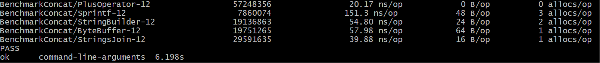

## Run benchmark results stdout to file

```bash
 go test -bench=. -benchmem -cpuprofile=cpu.out -memprofile=mem.out bench_test.go
 ```

 ## Run benchmark results stdout to console

```bash
go test -benchmem -bench=. bench_test.go
 ```
## Bench results quite intresting 


## There are a few reasons for that:
1. PlusOperator is optimized by the Go compiler to use a special "string concatenation" instruction, as strings are !constants! (for cons only) and can be concatenated at compile-time. 
2. Sprintf is slower due to formatting overhead as it needs to parse the format string, allocate memory for the result, and perform the formatting.
3. StringBuilder and ByteBuffer are slower due to method calls
Both strings.Builder and bytes.Buffer use method calls to concatenate strings, which introduces overhead compared to the + operator. The StringBuilder approach is slightly faster than ByteBuffer because it uses a specialized WriteString method that is optimized for string concatenation. 
4. StringsJoin is quite faster than expected because it uses a specialized implementation that is optimized for concatenating multiple strings with a separator. This implementation is more efficient than the StringBuilder and ByteBuffer approaches because it avoids the overhead of method calls and uses a more efficient algorithm.

    Compile-time optimization (e.g., + operator)
    Runtime overhead (e.g., Sprintf, method calls)
    Algorithmic efficiency (e.g., strings.Join)
